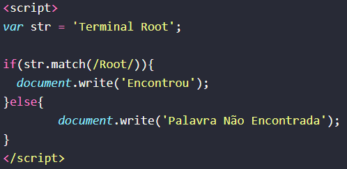
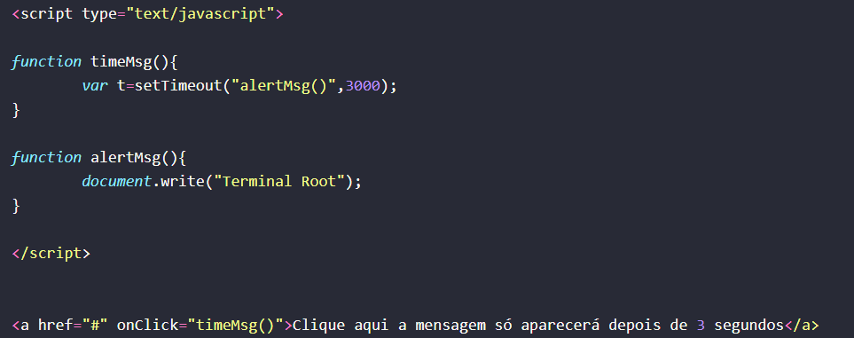

# Análise de códigos javascript

### Descrição

Este projeto consiste em, utilizando dois códigos disponíveis [aqui](https://terminalroot.com.br/2016/12/alguns-codigos-simples-de-javascript-2.html), analisá-los, implementá-los e testa-los. Após os testes, foi preciso identificar o que cada parte do javascript está fazendo e documentar tudo. Toda a documentação está disponível abaixo.

> Primeiro código

ENCONTRAR UMA PALAVRA NUMA STRING 

## 🖥️``1. Variável str:``
* Esta variável armazena a string 'Terminal Root', na qual será verificada a presença da palavra "Root".
Uso: A string é utilizada como base para a verificação da presença da palavra "Root".
## ``2. Condicional if...else:``
* Esta estrutura condicional verifica se a palavra "Root" está presente na string str e exibe uma mensagem correspondente.
Uso: É utilizada para determinar se a palavra "Root" foi encontrada na string str ou não.
## ``3. Método match():``
* O método match() é usado para encontrar correspondências entre uma string e uma expressão regular. Neste caso, ele verifica se a palavra "Root" está presente na string str.
Uso: Utilizado para realizar a verificação da presença da palavra "Root" na string str.
## ``4. Função document.write():``
* Esta função escreve conteúdo diretamente na página HTML. Aqui, é utilizada para exibir mensagens indicando se a palavra "Root" foi encontrada ou não.
Uso: Exibe mensagens na página HTML conforme o resultado da verificação da presença da palavra "Root".

> Segundo código 

## 🖥️``1. Função timeMsg():``
* Esta função é responsável por iniciar um temporizador que aguarda 3 segundos antes de chamar a função alertMsg() para exibir uma mensagem.
Uso: Utilizada para atrasar a exibição da mensagem em 3 segundos após a ativação.
## ``2. Função alertMsg():``
Descrição: Esta função é responsável por escrever a mensagem "Terminal Root" na página.
Uso: Utilizada para exibir a mensagem na página após o atraso de 3 segundos.
> HTML:
## ``3. Link <a>:``
* Este é um elemento HTML de âncora usado para criar um link sem destino específico (atributo href="#") que dispara a função timeMsg() quando clicado.
## ``4. Atributos:``
> onClick:
* Evento JavaScript que é acionado quando o link é clicado. Neste caso, a função timeMsg() é chamada.
## ``5. Texto de Ancoragem:``
* "Clique aqui a mensagem só aparecerá depois de 3 segundos"
Uso: Utilizado para criar um link que, quando clicado, inicia o processo de exibição da mensagem após 3 segundos.